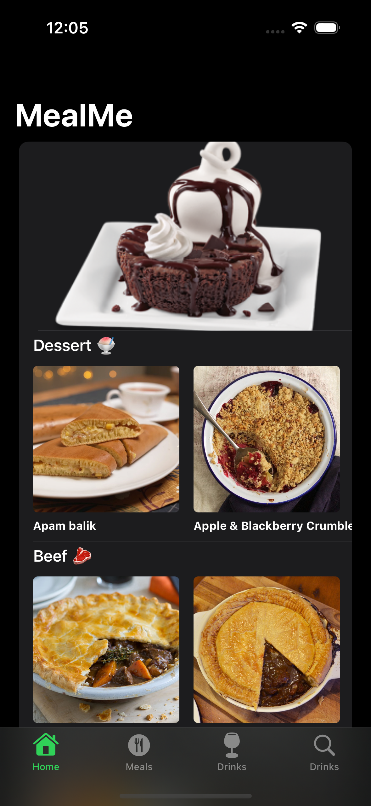

# MealMe

MealMe is a sleek and intuitive mobile application that helps users discover and explore a wide variety of delicious recipes. With a vast collection of recipes from various cuisines, users can easily search for their favorite dishes, save recipes as favourite and even search for drinks to go with their recipe.

## Features

- Browse through a diverse collection of recipes with detailed instructions and ingredient lists.
- Mark recipes as "favourite".
- Save your favorite recipes to access them offline.

## Requirements

- iOS 16.0 or later
- Xcode 14.0 or later
- Swift 5.0 or later

## Installation

1. Clone the repository
2. Open it the xcproj file using Xcode
3. Run the app

